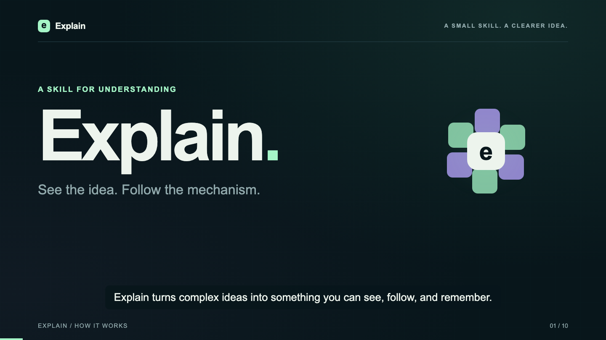

# Explain

**Choose the clearest way to teach an idea: words, diagrams, interactive pages, or video.**

A portable agent skill for Codex, Claude Code, and OpenCode. Explain starts with what someone needs to understand, then chooses a useful format. A short question can stay a short answer. A system with meaningful choices can become an interactive page. A story over time can become a narrated film.

[Try the interactive demo](https://asunchu.github.io/explain/examples/software-factory/) · [Watch the film](https://asunchu.github.io/explain/#film) · [Read the skill](skills/explain/SKILL.md)

[](https://asunchu.github.io/explain/#film)

## Install

Requires Node.js/npm for the installer:

```sh
npx skills add asunchu/explain --skill explain -g -a codex -a claude-code -a opencode
```

Choose only the agents you use. Omit `-g` for a project installation. The [open skills CLI](https://github.com/vercel-labs/skills) handles discovery and installation; it is a separate third-party tool. For manual installation, copy the complete `skills/explain/` directory into your harness's skill directory. Restart or reload the harness if necessary.

The skill itself has no runtime dependency. Video tools and speech models are installed only when an artifact requires them.

## Try it

```text
Use explain to explain database indexes with a small example.
Use explain to explain how software factories work with interactive HTML.
Use explain to make a narrated video of how this architecture works, using local TTS.
```

Codex supports `$explain`; Claude Code supports `/explain`. In OpenCode, ask the agent to use the `explain` skill. Natural-language discovery depends on your harness and model.

| What needs explaining | Typical format |
| --- | --- |
| A definition or small concept | Plain language + example |
| Structure and relationships | SVG or Mermaid |
| Cause and effect or alternative scenarios | Interactive HTML |
| A process over time or narrated story | Animated video |

An explicit format request takes precedence.

## Examples

- **[Software factory](examples/software-factory/):** one CSV-export feature travels through specification, implementation, verification, repair, human decisions, and release. Download its HTML and open it offline.
- **[Explain film](examples/explain-video/):** the skill explains its own workflow in a complete 2:11 video, with editable Remotion source, storyboard, transcript, captions, and local Kokoro narration. Speech API cost was $0; local compute is excluded.

Default animation choices include Remotion, HTML/SVG with GSAP when useful, Motion Canvas, and Three.js for spatial concepts. The narration guide compares local Kokoro, low-cost hosted Kokoro, and premium voices. Prices are dated examples, not guarantees; check the provider before spending.

## Automatic use

The description lets supporting harnesses select Explain automatically. For stronger routing, optionally add this sentence to your own global or project instructions (`AGENTS.md`, `CLAUDE.md`, or the equivalent):

> When a request would benefit from an explanation, use the Explain skill if available. Honor any requested format; otherwise choose the smallest effective medium. Simple answers may remain prose.

Installation does not rewrite system prompts or global instruction files, and automatic selection is not guaranteed.

## Compatibility and verification

The skill follows the [Agent Skills format](https://agentskills.io/specification) and uses ordinary file, shell, browser, and HTTP capabilities; no specific MCP server is required.

The examples were created in Codex. The HTML's routes and mobile layout were tested in a browser. The video was decoded and checked for codecs, timing, captions, and audio clipping; representative frames were visually reviewed. No independent listening audition was performed. Full behavioral evaluation in Claude Code and OpenCode remains community testing work. The video build commands target macOS/Linux.

### Clean cloud test

On October 3, 2026, a fresh GitHub-hosted Ubuntu 24.04 runner installed the public skill using `skills@1.7.0` for Codex, Claude Code, and OpenCode. All four skill files matched the repository for each target. The installer used the shared `~/.agents/skills/explain` location for Codex/OpenCode and a Claude Code symlink.

The runner then installed the pinned video dependencies and rendered the cache-example scene: 12.181 seconds, 1920×1080, 30 fps, H.264/AAC. Full media decoding passed. [Run and downloadable evidence](https://github.com/asunchu/explain/actions/runs/37154632292).

This is an installation and existing-example rendering test, not an AI-agent behavioral evaluation or a fresh TTS synthesis test. It ran in an ephemeral GitHub cloud runner, not an OpenAI cloud sandbox. Maintainers can repeat it through the **Cloud installation and render smoke test** workflow in Actions.

## Contribute

See [CONTRIBUTING.md](CONTRIBUTING.md). Useful contributions include clear examples, format-selection evaluations, portability fixes, and updated provider references. Run `python3 scripts/validate.py` before opening a pull request.

## License and inspiration

MIT for the original skill, source, and examples. Dependencies retain their own licenses; see [THIRD_PARTY.md](THIRD_PARTY.md). Inspired by [Andrej Karpathy's post on explanation formats](https://x.com/karpathy/status/2105819303471976479). No affiliation or endorsement is implied.
